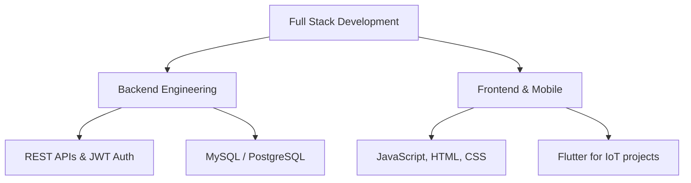

# Hi, I'm Arpita Nibedita 👋

---

<table>
<tr>
<td valign="top" width="50%">

## 🚀 About Me

**Java Full Stack Developer** seeking an entry-level Software Engineer role.

Java-focused software developer and technology enthusiast with certified internship experience in backend application development. Strong foundations in object-oriented programming, data structures, and database systems. Experienced in developing scalable Java-based solutions and working with web technologies and REST APIs in Agile environments.

Currently pursuing my Master of Computer Applications (MCA) at Adamas University (CGPA 8.5), with hands-on experience as a Software Trainee at Nvisagecomp Solutions and a Full Stack Developer Intern at Cognifyz Technologies.

</td>
<td valign="top" width="50%">

</td>
</tr>
</table>

---

## 💼 Experience

**Software Trainee** — Nvisagecomp Solutions *(Nov 2025 – Apr 2026)*
- Supporting backend development tasks as a trainee developer
- Assisting with database handling, debugging, and testing applications
- Learning enterprise software development practices and workflows

📄 [Certificate](https://drive.google.com/drive/folders/1ScXkfY1wzIAHmt-1ZbV6pVrLHdzkjYxD)

**Full Stack Developer Intern** — Cognifyz Technologies *(Jul 2025 – Aug 2025)*
- Built backend modules using Java and SQL, applying OOP principles and layered architecture
- Integrated REST APIs with database components, improving data retrieval efficiency
- Optimized application logic and SQL queries, reducing response time

📄 [Certificate](https://drive.google.com/drive/folders/10DHbPnzyYWG0ky40BCyNixOTUgS175OA)

---

## 🛠️ Skills

**Languages**

**Backend**

**Frontend**

**Databases**

**Mobile / IoT** *(used in project work)*

**Tools**

---

## 🎯 Focus Areas

---

## 🚀 Featured Projects

### 🔒 IoT Smart Door Lock & Security System — *MCA Project (Jan – May 2026)*
`Flutter` `Arduino` `ESP32-CAM` `GSM (SIM800L)` `AI Anomaly Detection`
- Decentralized smart door lock using a multi-microcontroller architecture (Arduino Uno R3, ESP32-CAM) with offline alerts via a GSM module
- Companion Flutter app supporting multi-factor access control — PIN, Wi-Fi, OTP, and biometric authentication
- Integrated AI-driven voice recognition and anomaly detection to flag suspicious entry patterns

**[→ View Repository](https://github.com/arpitanibedita/Smart-Door-lock-system)**

### 📦 Full-Stack Mini-ERP System — *(May – Jun 2025)*
`Node.js` `Express.js` `MySQL` `JavaScript` `HTML/CSS`
- Full-stack ERP dashboard to manage inventory levels and process real-time sales orders
- RESTful backend with Node.js/Express and MySQL, using transactional queries for accurate stock deductions
- Dynamic frontend using JavaScript and the Fetch API for real-time database updates

**[→ View Repository](https://github.com/arpitanibedita/Mini-Erp-system)**

### 📝 Content Management System — *(Jan – May 2024)*
`Java` `Servlets` `JDBC` `MySQL` `Apache Tomcat`
- Full-stack Java web app built to understand end-to-end backend-database interaction with Servlets and JDBC
- Designed relational schemas and optimized SQL queries for content creation and retrieval

**[→ View Repository](https://github.com/arpitanibedita/Content-Management-System)**

---

## 🎓 Education

| Degree | Institution | CGPA | Year |
|:--|:--|:--|:--|
| MCA | Adamas University, Kolkata | 8.5 | 2024 – 2026 |
| BCA | Utkal University, Bhubaneswar | 7.27 | 2021 – 2024 |

## 🏆 Certifications

| Certification | Issuer |
|:--|:--|
| ABAP Backend Cloud | SAP |
| APEX Cloud Developer Certification | Oracle |

📄 [Certification Links](https://drive.google.com/drive/folders/1aFF7ly8DKXVVqD3QK03fuuR8X1u_pe0M)

---

## 📊 GitHub Stats

  
  

  

## 🐍 Contribution Snake

  

---

## 📞 Let's Connect

**Open to:** Software Engineer Roles · Backend Development · Full Stack Development

